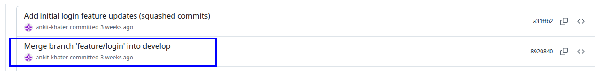
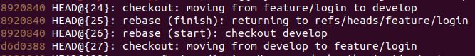
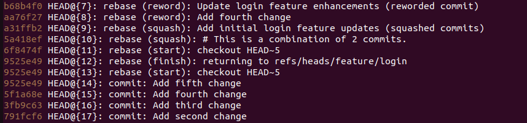
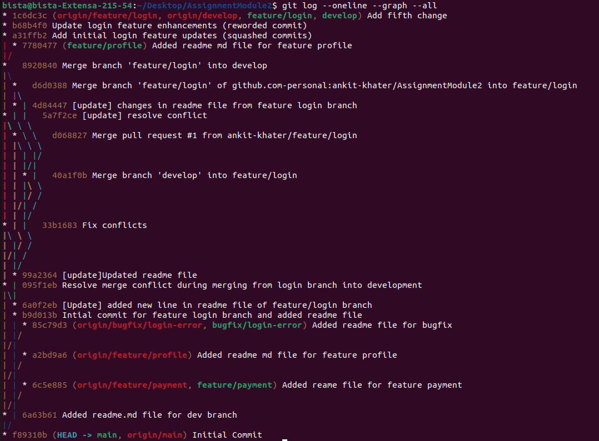

# 📘 Assignment: Advanced Git Workflow & Version Control

## 🎯 Objective
This repository demonstrates an enterprise-level Git workflow, including branching strategies, merging, rebasing, and commit history manipulation (squash and reword) as part of the Ostad Module 2 Assignment.

---

## 🛠️ Task 1: Repository Initialization

**Commands Used:**

# Initialize the repository
mkdir git-advanced-workflow.

cd git-advanced-workflow.

git init.

# Create the initial commit on main
git add README.md
git commit -m "Initial commit"
git branch -M main

# Create the required branches
git checkout -b develop
git checkout -b feature/login

## 🛠️ Task 2: Branching Workflow
**Commands Used:**
git checkout develop
git checkout -b feature/payment
git checkout develop
git checkout -b feature/profile

# 1. Create additional feature branches
git checkout develop
git checkout -b feature/payment
git checkout develop
git checkout -b feature/profile

# 2. Create a bugfix branch
git checkout develop
git checkout -b bugfix/login-error

## Task 3: Commit History Management

# 3. Perform a Merge Strategy (feature/login into develop)
git checkout develop
git merge feature/login 

# 4. Perform a Rebase Strategy 

# 5. Perform a Sqash and Reword Operation 

# Final Git Graph

